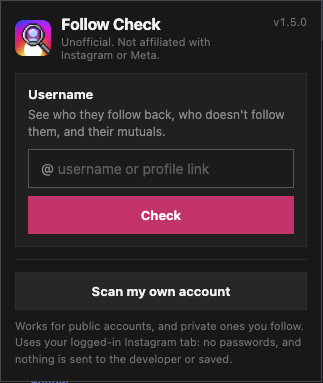

# Follow Check for Instagram

A Chrome extension that compares Instagram **followers** and **following** (yours, or any public account’s) from your already logged-in browser session.

No passwords. No Instagram login form. It only works when you’re signed in on [instagram.com](https://www.instagram.com/).

---

## Features

- See who **follows you back**
- See who you follow that **doesn’t follow back** — with **Remove**
- See who follows you that **you don’t follow** — with **Follow back**
- **Check any public account** (or a private one you follow): who they follow back, who doesn’t follow them back, and their mutuals
- Filter any list by **Verified** / **Not verified**
- Export results as **CSV**

---

## How it looks

### 1. Popup

Click the extension icon. Type any username to check that account, or scan your own.

### 2. Scanning

Followers and following load in parallel, with live progress.

### 3. Results

Browse categories, filter verified accounts, and take action. Usernames, names and photos are blurred here for privacy.

---

## Install

1. Clone this repo (or download the ZIP and unzip it)
2. Open Chrome → `chrome://extensions`
3. Turn on **Developer mode**
4. Click **Load unpacked**
5. Select this project folder
6. Open [instagram.com](https://www.instagram.com/) and log in
7. Click the **Follow Check** icon (top right of the page) → **Scan my lists**, or click the extension’s toolbar icon and check any username

---

## Usage

| Column | Meaning |
| --- | --- |
| Don’t follow you | You follow them; they don’t follow you |
| You don’t follow | They follow you; you don’t follow them |
| Follow back | Mutual follows |
| Followers / Following | Full lists |

On each row you can:

- **Remove** — unfollow someone you currently follow
- **Follow back** — follow someone who already follows you

Use the **All / Verified / Not verified** filters on any column.

### Check another account

Click the extension’s toolbar icon, type a username (or paste a profile link) and click **Check**. Instagram opens (or your open Instagram tab is used) and the panel shows the results. While results are open, the **Check another account** box at the top of the panel does the same without leaving the page.

| Column | Meaning |
| --- | --- |
| Don’t follow @them back | They follow these people; these people don’t follow them |
| @them doesn’t follow back | These people follow them; they don’t follow these people |
| Mutuals | They follow each other |

It works for public accounts and private accounts you follow, up to 20,000 followers or following. Remove / Follow back only appear on your own lists. The popup remembers your last five checks on this browser.

---

## Notes

- Requires an active Instagram web session in the same tab
- After updating the extension, click **Reload** on `chrome://extensions`, then refresh Instagram
- Large accounts take longer; followers and following load in parallel
- Use responsibly — this uses Instagram’s logged-in web APIs

---

## Privacy

- No passwords are collected
- No data is sent to a third-party server by this extension
- Comparison runs locally in your browser using your Instagram session
- Nothing is stored — results are discarded when you close or refresh the tab (the popup only keeps your last five checked usernames, locally)
- Full policy: [store/privacy-policy.html](store/privacy-policy.html)

This extension is unofficial and is not affiliated with Instagram or Meta.
